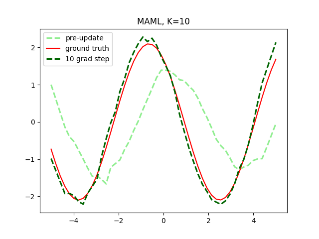

# Meta-Learning-SOC-24

In this repository, you will find various implementations related to meta-learning techniques explored during the Summer of Code 2024. One notable implementation is the [MAML algorithm](maml.py), which stands for Model-Agnostic Meta-Learning. This Python script demonstrates how to perform few-shot learning by training a model on multiple tasks and then fine-tuning it on new tasks with minimal data. The script includes functions for creating tasks, sampling data, performing inner-loop updates, and executing the meta-learning algorithm. The performance of the model is visualized in the generated plot below, showing the model's predictions before and after fine-tuning.

Additionally, a detailed [Midterm Report](MidTermReport_SOC_22b2505.pdf) on the implementations and findings during SOC '24 is attached to this repository.
